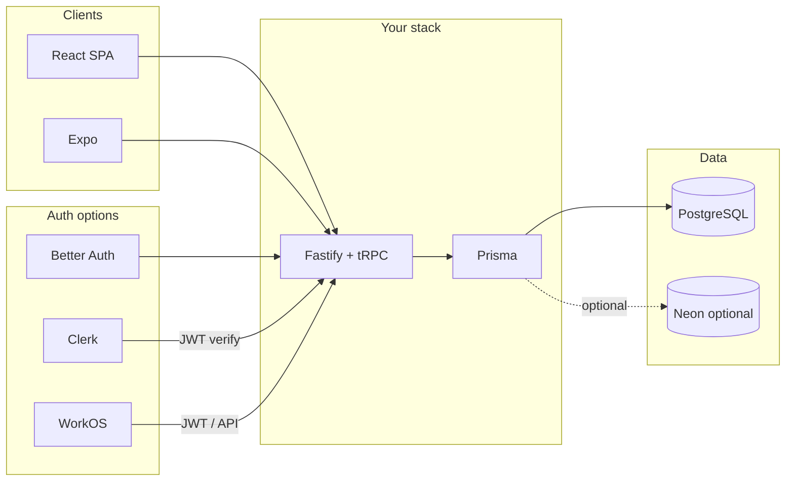

# Research: Services to Simplify Development (Auth, Users, and General Ease)

## Context from existing docs

Your [PLAN.md](.planning/PLAN.md) and supporting docs describe:

- **Stack:** Turborepo monorepo, React + Vite (SPA), Fastify + tRPC API, PostgreSQL + Prisma, Nginx + Docker on a VPS. Auth is **Better Auth** (framework-agnostic, TypeScript-first, chosen for standalone Fastify API and multi-user readiness).
- **Auth scope:** Single-user MVP with schema ready for multi-user; Phase 7 adds user registration, invite system, budget sharing (`BudgetCollaborator`), and shared objectives with email-based invites.
- **Other docs:** [SCHEMA_VISUALIZATION.md](.planning/docs/SCHEMA_VISUALIZATION.md) (User-centric schema), [SHARED_OBJECTIVES_DESIGN.md](.planning/docs/SHARED_OBJECTIVES_DESIGN.md) (invite + member flows), [DEDUPLICATION_RECONCILIATION.md](.planning/docs/DEDUPLICATION_RECONCILIATION.md) (staging pipeline), [BANK_SAT_INTEGRATION_RESEARCH.md](.planning/research/BANK_SAT_INTEGRATION_RESEARCH.md) (Belvo/Syncfy already researched).

You want to know if any **external services** can reduce effort—especially for **authentication and user management**—while staying consistent with this architecture.

---

## 1. Services to research and document

Research will be written into a new file: **[.planning/research/DEV_SERVICES_RESEARCH.md](.planning/research/DEV_SERVICES_RESEARCH.md)** (under the existing `research/` directory per your rules).

### 1.1 Authentication and user management

| Service                   | What it offers                                                                                                                                            | Relevance to this project                                                                                               |
| ------------------------- | --------------------------------------------------------------------------------------------------------------------------------------------------------- | ----------------------------------------------------------------------------------------------------------------------- |
| **Better Auth** (current) | Self-hosted or cloud, TypeScript, Fastify-compatible, sessions + JWT, org plugin (invites, members, roles)                                                | Already chosen; document how it compares and what to add (e.g. organization plugin for Phase 7).                        |
| **Clerk**                 | Managed auth, pre-built React components (`<SignIn />`, `<UserButton />`), JWT verification for any backend via `verifyToken()` / `authenticateRequest()` | Works with standalone Fastify + tRPC (verify JWT in `createContext`). Reduces UI work; adds cost and vendor dependency. |
| **Supabase Auth**         | Hosted auth, JWTs; optional `fastify-supabase`-style integration; link Supabase user ID to your `User` table                                              | Fits if you later use Supabase for DB/realtime; otherwise adds a second system.                                         |
| **Auth0**                 | Enterprise auth, many IdPs, high setup and cost at scale                                                                                                  | Overkill for MVP; note for future if compliance/SSO needed.                                                             |
| **WorkOS**                | Auth + User Management; invite flows, org-specific and app-wide invites, first 1M users free                                                              | Strong fit for Phase 7 invite/collaboration flows; compare with Better Auth organization plugin.                        |
| **SuperTokens**           | Open-source auth, official Fastify plugin, email/password, magic link, social, multi-tenancy                                                              | Alternative to Better Auth if you want OSS with first-class Fastify support and pre-built UI.                           |

The research doc will summarize: **when to stay with Better Auth** (control, no per-user cost, org plugin) vs **when to consider Clerk** (speed of UI, managed infra) vs **WorkOS** (invite/organization features) vs **SuperTokens** (OSS + Fastify). It will also note that **Clerk works with custom backends** (manual JWT verification in Fastify/tRPC context).

### 1.2 Hosted database and infra (development ease)

| Service                                | What it offers                                                                        | Relevance                                                                                               |
| -------------------------------------- | ------------------------------------------------------------------------------------- | ------------------------------------------------------------------------------------------------------- |
| **Neon**                               | Serverless Postgres, Prisma-compatible (`@prisma/adapter-neon`), branching, free tier | Eases DB hosting vs self-managed Postgres on VPS; cold starts if compute scales to zero.                |
| **Supabase**                           | Postgres + Auth + Realtime + Storage                                                  | Could replace or complement parts of your stack; larger architectural shift.                            |
| **Current (Docker + Postgres on VPS)** | Full control, no third-party DB                                                       | Baseline; research will say when Neon is worth it (e.g. simpler backups, branching, or moving off VPS). |

### 1.3 Other development-ease services (brief section)

- **Hosted Postgres (Neon, Supabase, Railway, etc.):** pros/cons vs current Docker Postgres.
- **BaaS (e.g. Firebase, Appwrite):** only brief mention—your app is committed to Fastify + tRPC + Prisma; BaaS would replace large parts of the backend and is out of scope unless you explicitly consider a pivot.
- **Coolify:** Already mentioned in PLAN.md for optional self-hosted PaaS; research doc can reference it for deploy ease.

---

## 2. Structure of the research document

The new file **.planning/research/DEV_SERVICES_RESEARCH.md** will:

1. **Reference planning state** — Short summary of stack and Phase 7 auth/collaboration needs (with links to PLAN.md and SHARED_OBJECTIVES_DESIGN.md).
2. **Auth and user management** — For each service (Better Auth, Clerk, Supabase Auth, Auth0, WorkOS, SuperTokens): what it does, how it fits a Fastify + tRPC API, invite/org support, pricing ballpark, and pros/cons. A small comparison table and a “Recommendation” subsection (e.g. stay with Better Auth; add organization plugin for Phase 7; consider Clerk or WorkOS only if X).
3. **Hosted database / infra** — Neon (and optionally Supabase Postgres) vs self-hosted Postgres: setup with Prisma, cold starts, backups, when to adopt.
4. **Other services** — Short notes on Coolify, and why full BaaS is not recommended for this codebase.
5. **Action items** — Concrete next steps (e.g. “Enable Better Auth organization plugin in Phase 7”, “Re-evaluate Clerk if pre-built auth UI becomes a bottleneck”, “Try Neon for staging if you want DB branching”).

No code or repo changes beyond adding this one research file.

---

## 3. Out of scope for this research

- Implementing any service (plan-only; no edits to app or config).
- Changing the chosen stack (React, Vite, Fastify, tRPC, Prisma, Better Auth) unless the research explicitly recommends a considered alternative with rationale.
- Bank/SAT integration (already covered in [BANK_SAT_INTEGRATION_RESEARCH.md](.planning/research/BANK_SAT_INTEGRATION_RESEARCH.md)).

---

## 4. Deliverable

- **Single new file:** [.planning/research/DEV_SERVICES_RESEARCH.md](.planning/research/DEV_SERVICES_RESEARCH.md) containing the sections above, with links to official docs and pricing where relevant.
- **Summary here:** After the doc is written, you will have a clear, referenced recommendation set (e.g. keep Better Auth + add org plugin; consider Clerk/WorkOS/Neon only under specific conditions).

---

## 5. Diagram (for the research doc)

Optional diagram to include in **DEV_SERVICES_RESEARCH.md** to show where external services plug in:

This keeps the plan concise and actionable while ensuring all planning docs are reflected and the new research lives in `.planning/research/` as required.