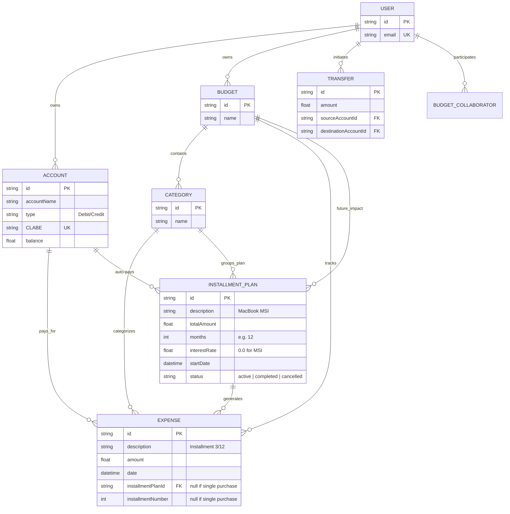

# Database Schema Visualization

This document contains the Mermaid ER diagram for the Budget Manager database, including the support for split purchases (Meses Sin Intereses - MSI).

## Entity Relationship Diagram

## Logic for Split Expenses (MSI)

1.  **Orchestration**: The `InstallmentPlan` acts as a parent entity. When created, the system generates $N$ `Expense` records scheduled over the coming months.
2.  **Budgeting**: Individual `Expense` records hit the monthly budget, preventing a single large purchase from "breaking" the budget of the month it was purchased in.
3.  **Debt Tracking**: By querying future expenses linked to an `InstallmentPlan`, the system can calculate the remaining balance of the debt.
4.  **Interest**: Supports both 0% (MSI) and interest-bearing installment plans through the `interestRate` field.
