# Database Schema Visualization

This document contains the Mermaid ER diagram for the Budget Manager database.
It reflects all resolved decisions from [PLAN.md](../PLAN.md) and includes the
shared objectives feature design.

> **Conventions:**
> - All monetary amounts are stored as **integers** (centavos/cents) to avoid
>   floating-point errors. The app converts to/from display format.
> - All entities have a `userId` FK for multi-user readiness.
> - `currency` is an enum: `MXN` | `USD`.
> - `id` fields use UUIDs (cuid2 via Prisma).

---

## 1. Core Entity Relationship Diagram

```mermaid
erDiagram
    %% ── User & Auth ──
    USER ||--o{ ACCOUNT : owns
    USER ||--o{ BUDGET : owns
    USER ||--o{ CATEGORY : defines
    USER ||--o{ RECURRING_EXPENSE : plans
    USER ||--o{ EXPENSE : records
    USER ||--o{ TRANSFER : initiates
    USER ||--o{ INSTALLMENT_PLAN : creates
    USER ||--o{ SAVINGS_GOAL : sets
    USER ||--o{ BUDGET_COLLABORATOR : participates_in
    USER ||--o{ BANK_LINK : connects
    USER ||--o{ OBJECTIVE_MEMBER : joins

    %% ── Budget structure ──
    BUDGET ||--o{ EXPENSE : contains
    BUDGET ||--o{ BUDGET_COLLABORATOR : shared_with

    %% ── Category ──
    CATEGORY ||--o{ EXPENSE : categorizes
    CATEGORY ||--o{ RECURRING_EXPENSE : groups
    CATEGORY ||--o{ INSTALLMENT_PLAN : groups

    %% ── Account ──
    ACCOUNT ||--o{ EXPENSE : charged_to
    ACCOUNT ||--o{ RECURRING_EXPENSE : "source_account"
    ACCOUNT ||--o{ RECURRING_EXPENSE : "dest_account"
    ACCOUNT ||--o{ TRANSFER : "source"
    ACCOUNT ||--o{ TRANSFER : "destination"
    ACCOUNT ||--o{ INSTALLMENT_PLAN : pays
    ACCOUNT ||--o{ SAVINGS_GOAL : holds
    ACCOUNT ||--o{ BANK_LINK : linked_via

    %% ── Installment plans ──
    INSTALLMENT_PLAN ||--o{ EXPENSE : generates

    %% ── Shared Objectives ──
    SHARED_OBJECTIVE ||--o{ OBJECTIVE_MEMBER : has_members
    SHARED_OBJECTIVE ||--o{ OBJECTIVE_CONTRIBUTION : receives
    OBJECTIVE_MEMBER ||--o{ OBJECTIVE_CONTRIBUTION : contributes
    ACCOUNT |o--o{ SHARED_OBJECTIVE : "target_account"

    %% ── Entity definitions ──

    USER {
        string id PK "cuid2"
        string email UK
        string name
        string avatarUrl "nullable"
        datetime createdAt
        datetime updatedAt
    }

    ACCOUNT {
        string id PK
        string userId FK
        string name "HSBC World Elite"
        string type "debit | credit | investment | cash"
        string currency "MXN | USD"
        string clabe UK "nullable"
        int balance "centavos/cents"
        string institution "nullable — HSBC, Nu, etc."
        string bankLinkId FK "nullable — Belvo link"
        datetime createdAt
        datetime updatedAt
    }

    BUDGET {
        string id PK
        string userId FK
        string name "nullable — auto: Jan 2026"
        int month "1-12"
        int year "2026"
        datetime createdAt
        datetime updatedAt
    }

    CATEGORY {
        string id PK
        string userId FK
        string name "Kids, Auto, Zuhause..."
        string icon "nullable — emoji or icon name"
        string color "nullable — hex color"
        int sortOrder "display ordering"
        datetime createdAt
    }

    RECURRING_EXPENSE {
        string id PK
        string userId FK
        string categoryId FK
        string sourceAccountId FK "Cuenta Cargo"
        string destAccountId FK "nullable — Cuenta Deposito"
        string description "Colegiatura Lena"
        int amount "centavos — monthly equivalent"
        string currency "MXN | USD"
        string frequency "monthly | biweekly | annual | bimonthly"
        boolean isAnnual "true if billed yearly"
        int annualCost "nullable — centavos"
        string notes "nullable"
        boolean isActive "soft toggle"
        datetime createdAt
        datetime updatedAt
    }

    EXPENSE {
        string id PK
        string userId FK
        string budgetId FK
        string categoryId FK
        string accountId FK "which account was charged"
        string installmentPlanId FK "nullable — if part of MSI"
        string objectiveContributionId FK "nullable — if toward objective"
        string description
        int amount "centavos/cents"
        string currency "MXN | USD"
        datetime date
        int installmentNumber "nullable — e.g. 3 of 12"
        string source "manual | belvo | cfdi | csv"
        string externalId "nullable — Belvo txn ID or CFDI UUID"
        datetime createdAt
        datetime updatedAt
    }

    INSTALLMENT_PLAN {
        string id PK
        string userId FK
        string accountId FK "credit card used"
        string categoryId FK
        string description "MacBook Pro MSI"
        int totalAmount "centavos"
        string currency "MXN | USD"
        int months "e.g. 12"
        float interestRate "0.0 for MSI"
        datetime startDate
        string status "active | completed | cancelled"
        datetime createdAt
        datetime updatedAt
    }

    TRANSFER {
        string id PK
        string userId FK
        string sourceAccountId FK
        string destAccountId FK
        int amount "centavos"
        string currency "MXN | USD"
        datetime date
        string notes "nullable"
        datetime createdAt
    }

    SAVINGS_GOAL {
        string id PK
        string userId FK
        string accountId FK "target savings account"
        string name "Largo Plazo, Corto Plazo"
        float targetPercentage "nullable — 11% of salary"
        int targetAmount "nullable — centavos"
        string currency "MXN | USD"
        string notes "nullable"
        datetime createdAt
        datetime updatedAt
    }

    BUDGET_COLLABORATOR {
        string id PK
        string budgetId FK
        string userId FK
        string role "owner | editor | viewer"
        datetime createdAt
    }

    BANK_LINK {
        string id PK
        string userId FK
        string accountId FK "nullable — linked account"
        string provider "belvo | syncfy"
        string externalLinkId "provider's link ID"
        string status "active | inactive | error"
        datetime lastSyncAt "nullable"
        datetime createdAt
        datetime updatedAt
    }

    SHARED_OBJECTIVE {
        string id PK
        string createdByUserId FK
        string accountId FK "target account for funds"
        string name "House Down Payment"
        string description "nullable"
        int targetAmount "centavos"
        string currency "MXN | USD"
        int currentAmount "centavos — denormalized sum"
        datetime targetDate "nullable"
        string status "active | completed | cancelled"
        datetime createdAt
        datetime updatedAt
    }

    OBJECTIVE_MEMBER {
        string id PK
        string objectiveId FK
        string userId FK
        string budgetId FK "nullable — which budget to track as expense"
        string categoryId FK "nullable — which category in their budget"
        string accountId FK "nullable — source account for contributions"
        string role "owner | contributor"
        datetime joinedAt
    }

    OBJECTIVE_CONTRIBUTION {
        string id PK
        string objectiveId FK
        string memberId FK "ObjectiveMember"
        string expenseId FK "nullable — linked Expense in contributor's budget"
        int amount "centavos"
        string currency "MXN | USD"
        datetime date
        string notes "nullable"
        datetime createdAt
    }
```



---

## 2. Logic for Split Expenses (MSI)

1. **Orchestration**: The `InstallmentPlan` acts as a parent entity. When
   created, the system generates *N* `Expense` records scheduled over the
   coming months, each linked to the plan and assigned sequential
   `installmentNumber` values.
2. **Budgeting**: Individual `Expense` records land in the corresponding
   monthly `Budget`, preventing a single large purchase from "breaking" the
   budget of the month it was purchased in.
3. **Debt Tracking**: Query future expenses linked to an `InstallmentPlan`
   to calculate remaining balance.
4. **Interest**: Supports both 0% (MSI) and interest-bearing installment
   plans through the `interestRate` field.

---

## 3. Logic for Recurring Expenses

1. **Templates**: Each `RecurringExpense` represents a planned, repeating
   charge (the rows in the original CSV spreadsheet).
2. **Budget Generation**: At the start of each month (or on demand), the
   system generates `Expense` records from active `RecurringExpense`
   templates into the current month's `Budget`.
3. **Frequency Handling**:
   - `monthly` → one expense per month
   - `biweekly` → two expenses per month (aligned with salary dates)
   - `annual` → one expense in the billing month, OR prorated monthly
     using `annualCost / 12`
   - `bimonthly` → one expense every two months (e.g., gas, electricity)
4. **Account Routing**: `sourceAccountId` (Cuenta Cargo) is where money
   comes from. `destAccountId` (Cuenta Deposito) is where it goes. This
   models the real flow in the CSV (e.g., HSBC → Nu Cajita Gastos).

---

## 4. Logic for Shared Objectives

> See [SHARED_OBJECTIVES_DESIGN.md](SHARED_OBJECTIVES_DESIGN.md) for the
> full feature design document.

### 4.1 The Core Problem

Two users want to save toward a shared goal. Each contribution should:
- Appear as an **expense** in the contributor's personal budget
- Appear as a **contribution** toward the shared objective
- Track progress toward the target amount
- Allow each user to independently choose which budget category and account
  to debit from

### 4.2 How It Works

```
User A (Budget: "Alfredo Jan 2026")     User B (Budget: "Dalia Jan 2026")
    │                                        │
    ├─ Expense: "$5,000 → House Fund"        ├─ Expense: "$3,000 → House Fund"
    │  category: Savings                     │  category: Savings
    │  account: HSBC Debit                   │  account: Nu Dalia Debito
    │                                        │
    └──────────────┬─────────────────────────┘
                   │
                   ▼
        ┌─────────────────────┐
        │  Shared Objective   │
        │  "House Down Payment"│
        │  Target: $500,000   │
        │  Current: $8,000    │
        │  Account: GBM       │
        └─────────────────────┘
```

### 4.3 Entity Relationships

- **SharedObjective** — The goal itself (name, target, account, deadline)
- **ObjectiveMember** — Links a user to an objective with their personal
  budget/category/account preferences for tracking contributions
- **ObjectiveContribution** — Each deposit toward the goal. Optionally
  linked to an `Expense` record in the contributor's budget (via
  `expenseId`), creating the dual-tracking behavior.

### 4.4 Key Design Decisions

1. **Contribution creates an Expense automatically.** When a user logs a
   contribution, the system also creates an `Expense` in their budget
   (using the category and account configured in their `ObjectiveMember`
   record). This ensures it shows up in their monthly budget totals.

2. **Each member configures their own tracking.** User A might track
   contributions under "Savings" from their HSBC account. User B might
   use "Inversiones" from their Nu account. The objective doesn't
   dictate how each person categorizes the spending.

3. **`currentAmount` is denormalized.** It's updated on every contribution
   for fast dashboard reads. A background check can reconcile against
   `SUM(contributions)` periodically.

4. **Objective account is shared reference.** The `accountId` on
   `SharedObjective` represents where the money physically lives (e.g.,
   an investment account, savings account). Both users can see it but it
   may belong to just one of them in the `Account` table.

5. **Works across budgets.** Users don't need to share a budget to share
   an objective. User A has their budget, User B has theirs. The objective
   is a separate entity that both reference.

---

## 5. Data Source Tracking

The `source` field on `Expense` tracks how each expense was created:

| Source | Meaning |
|---|---|
| `manual` | User entered it by hand |
| `belvo` | Imported from Belvo bank transaction sync |
| `cfdi` | Imported from SAT CFDI (invoice) |
| `csv` | Imported from uploaded CSV/OFX file |
| `recurring` | Auto-generated from a RecurringExpense template |
| `installment` | Auto-generated from an InstallmentPlan |
| `objective` | Auto-generated from an ObjectiveContribution |

The `externalId` field stores the provider's unique identifier (Belvo
transaction ID, CFDI UUID, etc.) for deduplication.

---

## 6. Currency Handling

All monetary fields use **integers** representing the smallest currency unit:

| Currency | Unit | Example |
|---|---|---|
| MXN | centavos | $15,800.00 → `1580000` |
| USD | cents | $100.50 → `10050` |

The application layer handles conversion to/from display format using
`Intl.NumberFormat` with the appropriate locale and currency code.

This avoids floating-point arithmetic errors (e.g., `0.1 + 0.2 !== 0.3`
in JavaScript) which are unacceptable for financial data.
