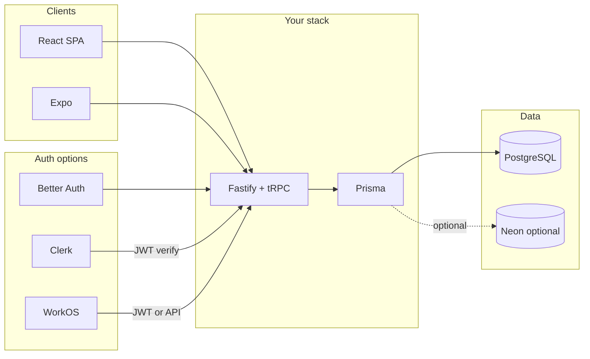

# Development Services Research: Auth, Users, and Development Ease

> This document evaluates third-party services that could simplify development for
> the Budget Manager app—especially authentication, user management, and
> infrastructure. Referenced from [PLAN.md](../PLAN.md) (stack, Phase 7 multi-user/invites).

---

## Table of Contents

1. [Planning context](#1-planning-context)
2. [Where external services plug in](#2-where-external-services-plug-in)
3. [Authentication and user management](#3-authentication-and-user-management)
4. [Hosted database and infrastructure](#4-hosted-database-and-infrastructure)
5. [Other development-ease services](#5-other-development-ease-services)
6. [Recommendations](#6-recommendations)
7. [Action items](#7-action-items)

---

## 1. Planning context

From [PLAN.md](../PLAN.md) and supporting docs:

- **Stack:** Turborepo monorepo, React + Vite (SPA), Fastify + tRPC API, PostgreSQL + Prisma, Nginx + Docker on a VPS. Auth is **Better Auth** (framework-agnostic, TypeScript-first, chosen for standalone Fastify API and multi-user readiness).
- **Auth scope:** Single-user MVP with schema ready for multi-user; **Phase 7** adds user registration, invite system, budget sharing (`BudgetCollaborator`), and shared objectives with email-based invites (see [SHARED_OBJECTIVES_DESIGN.md](../docs/SHARED_OBJECTIVES_DESIGN.md)).
- **Schema:** User-centric; all entities have `userId` FK. [SCHEMA_VISUALIZATION.md](../docs/SCHEMA_VISUALIZATION.md) describes the full model.

This research answers: *Are there services that could reduce effort—especially for authentication and user management—while staying consistent with this architecture?*

---

## 2. Where external services plug in

Auth services sit in front of or alongside your API: they issue/validate tokens; your Fastify + tRPC layer verifies the token (e.g. in `createContext`) and uses Prisma with the resolved user. Hosted Postgres (e.g. Neon) replaces or complements self-hosted PostgreSQL.

---

## 3. Authentication and user management

### 3.1 Better Auth (current choice)

| Aspect | Details |
|--------|---------|
| **What it is** | Open-source, TypeScript-first auth library; self-hosted or cloud. Works with Fastify, Hono, Express. |
| **Fit with Fastify + tRPC** | Native. You mount Better Auth routes on Fastify; session/JWT is available in tRPC `createContext`. |
| **Invite / org support** | **Organization plugin** adds organizations, members, roles. Invite flows: add/remove members, role-based access. Caveat: inviting users who don’t yet have accounts may need extra handling (see community/Discord). |
| **Pricing** | No per-user fee when self-hosted. Cloud offering has its own pricing. |
| **Pros** | Full control, data in your DB, no per-user cost, org plugin aligns with Phase 7 (BudgetCollaborator, shared objectives). Already chosen and fits the stack. |
| **Cons** | You build (or customize) auth UI; less “drop-in” than Clerk. |

**Conclusion:** Staying with Better Auth is consistent with the plan. Enable the **organization plugin** in Phase 7 for invites and budget sharing; implement custom invite UX for “user doesn’t exist yet” if needed.

---

### 3.2 Clerk

| Aspect | Details |
|--------|---------|
| **What it is** | Managed authentication and user management. Pre-built React components: `<SignIn />`, `<SignUp />`, `<UserButton />`, etc. |
| **Fit with Fastify + tRPC** | **Works with custom backends.** Use the JS Backend SDK: `verifyToken()` or `authenticateRequest()` to validate Clerk-issued JWTs. Extract token from cookie `__session` or `Authorization` header; verify in Fastify middleware or tRPC `createContext`; pass user into context. Documented for Express, Astro, React Router, TanStack Start—same pattern applies to Fastify. |
| **Invite / org support** | Organizations and invites are first-class; dashboard and API for inviting users, roles, etc. |
| **Pricing** | Free tier (e.g. 10K MAU); then paid. Pro plan around $25/month; scales with usage. |
| **Pros** | Fastest path to polished auth UI; no auth server to run; strong invite/org features. |
| **Cons** | Vendor lock-in; per-user cost at scale; user data lives in Clerk (you still keep your `User` table and link by Clerk `userId`). |

**Conclusion:** Consider **Clerk** only if you want to ship auth UI very quickly and accept managed dependency and cost. Integration with Fastify + tRPC is straightforward (JWT verification in context).

---

### 3.3 Supabase Auth

| Aspect | Details |
|--------|---------|
| **What it is** | Hosted auth (email, magic link, OAuth). JWTs; optional Row Level Security (RLS) if you use Supabase Postgres. |
| **Fit with Fastify + tRPC** | Use Supabase only for auth: frontend gets session; send access token to Fastify; verify JWT (e.g. with `fastify-supabase` or manual verify). Create/link your own `User` row keyed by Supabase user ID. |
| **Invite / org support** | Invites via Supabase API/dashboard; no built-in “organizations” like Clerk/Better Auth—you’d model that in your schema. |
| **Pricing** | Generous free tier (e.g. 50K MAU). |
| **Pros** | Low cost, simple if you already use Supabase for DB/realtime. |
| **Cons** | Adds a second system unless you adopt Supabase more broadly; you still own invite/collab logic in your app. |

**Conclusion:** Makes sense if you **later** adopt Supabase for Postgres or realtime. For “auth only” with current Fastify + own Postgres, Better Auth is simpler.

---

### 3.4 Auth0

| Aspect | Details |
|--------|---------|
| **What it is** | Enterprise auth platform: Universal Login, many IdPs, SAML/SSO, compliance. |
| **Fit with Fastify + tRPC** | JWT verification in Fastify/tRPC context; well-documented. |
| **Pricing** | Free tier (e.g. 7.5K MAU); at 100K users can exceed $500/month. |
| **Pros** | Strong for compliance, SSO, enterprise. |
| **Cons** | Heavier setup (4–8 hours typical); overkill for MVP and personal/small-team use. |

**Conclusion:** Not recommended for current scope. Revisit if you need enterprise SSO or strict compliance.

---

### 3.5 WorkOS

| Aspect | Details |
|--------|---------|
| **What it is** | Auth + User Management: AuthKit (login, MFA, etc.) and high-level invite/organization APIs. |
| **Fit with Fastify + tRPC** | Verify WorkOS JWTs in Fastify; use WorkOS APIs for invitations (org-specific or app-wide). Two-step invite flow: create invitation → invitee accepts (email signup or add to org). |
| **Invite / org support** | **Strong.** Invitations, org membership, quota management; first 1M users free (pay-as-you-go). |
| **Pricing** | First 1M active users free; then $2,500/month per additional 1M. SSO, Directory Sync, Audit Logs are extra. |
| **Pros** | Very good fit for Phase 7-style invite and collaboration flows without building your own invite system. |
| **Cons** | Another vendor; your app still needs to map WorkOS users to your `User` and `BudgetCollaborator` / `SharedObjective` models. |

**Conclusion:** Best **alternative** if you want a managed invite/organization layer and are OK with a third-party. Compare with Better Auth organization plugin effort before switching.

---

### 3.6 SuperTokens

| Aspect | Details |
|--------|---------|
| **What it is** | Open-source auth: email/password, magic link, social, SSO, multi-tenancy. |
| **Fit with Fastify + tRPC** | **Official Fastify plugin** (supertokens-node, framework/fastify module). Handles sessions, error handling, request/response. |
| **Invite / org support** | Multi-tenancy and account linking; invite flows would be custom on top. |
| **Pricing** | Open-source; self-hosted free. |
| **Pros** | OSS, first-class Fastify support, pre-built UI option, no per-user fee. |
| **Cons** | You’d replace Better Auth and migrate; invite/collab still largely custom. |

**Conclusion:** Solid **alternative to Better Auth** if you prefer an OSS stack with official Fastify integration. Only worth a migration if you hit limits with Better Auth.

---

### 3.7 Auth comparison summary

| Service      | Works with Fastify + tRPC | Invite/org support      | Cost (typical)     | Best for                          |
|-------------|---------------------------|--------------------------|--------------------|-----------------------------------|
| Better Auth | Native                     | Plugin (organization)    | Free (self-host)   | Current stack; full control       |
| Clerk       | Yes (JWT verify)          | Strong                   | Free tier → paid   | Fastest auth UI; managed          |
| Supabase Auth | Yes (JWT verify)        | Basic invites            | Free tier          | If using Supabase for DB/realtime |
| Auth0       | Yes                       | Enterprise               | Free tier → expensive | Enterprise SSO/compliance     |
| WorkOS      | Yes                       | Strong (invites, orgs)   | 1M free            | Managed invite/collab flows       |
| SuperTokens | Yes (official plugin)     | Multi-tenant; custom invite | Free (OSS)     | OSS + Fastify alternative to Better Auth |

---

## 4. Hosted database and infrastructure

### 4.1 Neon (serverless Postgres)

| Aspect | Details |
|--------|---------|
| **What it is** | Fully managed serverless PostgreSQL; storage and compute separate; branching; Prisma-compatible. |
| **Integration** | Use pooled connection string for app; direct connection for migrations. Prisma: `@prisma/adapter-neon` (Prisma 5.4.2+). |
| **Pricing** | Free tier; paid for more storage/compute. |
| **Pros** | No Postgres to run on VPS; backups, branching, scaling handled. Good for staging/branch DBs. |
| **Cons** | Cold starts if compute scales to zero (e.g. after 5 min inactivity); ~500 ms–several seconds. Use pooled connection to mitigate. |

**Conclusion:** Consider **Neon** for staging or if you want to simplify DB hosting and backups. For a single low-traffic VPS, current Docker Postgres is fine; Neon becomes attractive when you want zero-DB-ops or branch environments.

### 4.2 Supabase (Postgres + Auth + Realtime)

Using Supabase for Postgres means using their pooler and possibly RLS. It’s a larger architectural choice (auth + optional realtime + storage). Not required for the current plan; document only if you later consider moving more of the backend to Supabase.

### 4.3 Current setup (Docker + Postgres on VPS)

Remains the baseline: full control, no third-party DB, matches [PLAN.md](../PLAN.md) deployment (Docker Compose, Nginx, Fastify, Postgres).

---

## 5. Other development-ease services

- **Coolify:** Already referenced in PLAN.md as an optional self-hosted PaaS (git push deploy, Docker management). Use it if you want Heroku-like deploy flow on your own VPS.
- **BaaS (Firebase, Appwrite, etc.):** Would replace or duplicate Fastify + tRPC + Prisma with a different backend model. **Not recommended** for this codebase unless you explicitly decide to pivot; the current stack is already defined and working.
- **Hosted Postgres (Neon, Railway, etc.):** Covered in Section 4. Use when you want to offload DB ops or need branching; otherwise stay with Docker Postgres.

---

## 6. Recommendations

1. **Auth:** **Keep Better Auth.** It fits the stack, is already chosen, and has an organization plugin for Phase 7. Add the plugin when implementing multi-user and shared objectives; handle “invite user without account” in your own flow if needed.
2. **Invites / collaboration:** Prefer **Better Auth organization plugin** first. Re-evaluate **WorkOS** or **Clerk** only if you need a managed invite/organization layer and are willing to take on vendor and cost.
3. **Auth UI speed:** If you later prioritize “ship auth UI in a day,” **Clerk** is the best candidate; integrate via JWT verification in Fastify/tRPC context.
4. **Database:** **Stay with Docker Postgres** for MVP. Consider **Neon** for staging or when you want managed Postgres, backups, or branch DBs.
5. **No BaaS pivot:** Keep Fastify + tRPC + Prisma as the backend; use external services only at the edges (auth provider, optional hosted DB).

---

## 7. Action items

- [ ] In **Phase 7**, enable Better Auth **organization plugin** and implement invite + member flows for budget sharing and shared objectives.
- [ ] If pre-built auth UI becomes a bottleneck, re-evaluate **Clerk** (JWT verify in Fastify/tRPC) vs building on Better Auth components.
- [ ] If you want managed invite/organization without building it, compare **WorkOS** (invite APIs, pricing) vs Better Auth organization plugin effort.
- [ ] Optional: try **Neon** for a staging environment if you want DB branching or to simplify DB hosting.
- [ ] Keep this document updated when you trial or adopt any of these services.
