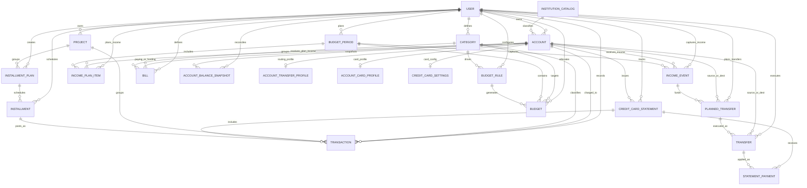

# Finance V2 ERD

## Mermaid ERD

## DBML Note

Use `.planning/docs/SCHEMA_VISUALIZATION.md` + the branch Prisma schema as the source of truth for implementation.
This document is a conceptual map of the transactions-first model.
