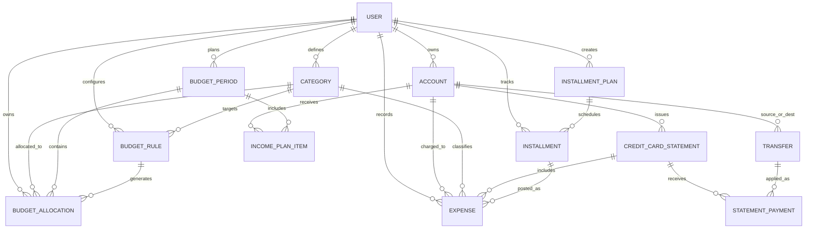

# Finance V2 ERD

## Mermaid ERD



## DBML (dbdiagram.io)

```dbml
Table budget_periods {
  id text [pk]
  user_id text
  month text
  currency text
  expected_income_amount int
}

Table income_plan_items {
  id text [pk]
  budget_period_id text
  account_id text [null]
  source text
  amount int
  is_recurring boolean
}

Table budget_rules {
  id text [pk]
  user_id text
  category_id text
  rule_type text
  value int
  apply_order int
  min_amount int [null]
  cap_amount int [null]
  active_from text [null]
  active_to text [null]
}

Table budget_allocations {
  id text [pk]
  user_id text
  budget_period_id text
  category_id text
  planned_amount int
  generated_from_rule_id text [null]
  is_override boolean
}

Table credit_card_statements {
  id text [pk]
  account_id text
  period_start datetime
  period_end datetime
  closing_date datetime
  due_date datetime
  statement_balance int
  payments_applied int
  status text
}

Table statement_payments {
  id text [pk]
  statement_id text
  transfer_id text
  amount_applied int
}

Table installments {
  id text [pk]
  user_id text
  installment_plan_id text
  installment_number int
  due_date datetime
  amount int
}
```
